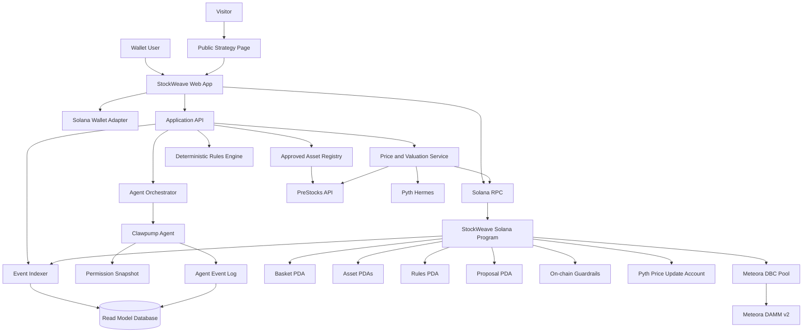
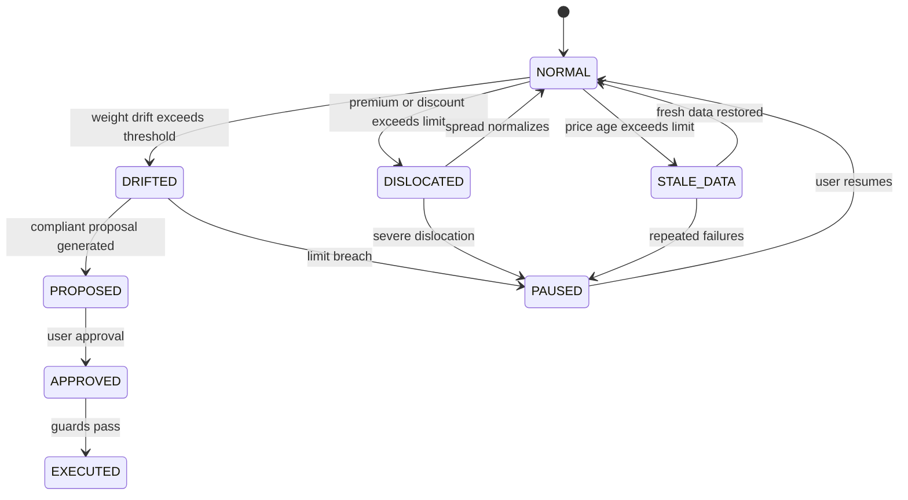

# StockWeave: Judge-Ready Architecture and Product Design

## 1. Product decision

**StockWeave is a public, forkable strategy layer for tokenized stocks.** It lets crypto-native users inspect, simulate, fork, and follow transparent stock strategies whose rules and agent permissions are visible on Solana.

The first release is not a general ETF builder, an autonomous hedge fund, a brokerage, or a generic AI portfolio assistant. It is one polished workflow:

> **Create one strategy basket, value it with Pyth, detect a rule violation, generate an agent proposal, enforce the proposal on-chain, and let another user fork the strategy.**

### Product promise

> **Follow a stock strategy without trusting a black box. Inspect its assets, rules, data, permissions, and decisions on-chain.**

### Target first user

The first user is a crypto-native participant who understands wallets and tokens but does not want to follow an opaque portfolio manager. This user values public state, explainable rules, forkability, and user-controlled permissions more than a conventional brokerage interface.

## 2. What makes StockWeave different

A basket alone is familiar. An AI agent alone is familiar. A tokenized-stock dashboard is familiar.

The differentiated primitive is:

```text
Public strategy
+ inspectable rules
+ forkable configuration
+ Pyth-driven market state
+ machine-enforced agent permissions
+ on-chain rebalance proposals
```

The basket becomes a strategy object that another user can inspect, simulate, fork, and follow. The agent is not presented as a prediction engine. It is an operator that must remain inside an explicit mandate.

## 3. The one golden path

The entire hackathon submission should optimize one path:

```text
Create demo basket
  → load token and reference prices
  → show current allocation and data quality
  → trigger allocation drift or stale data
  → Pyth changes the basket state
  → Clawpump agent explains the state
  → agent creates an on-chain rebalance proposal
  → Solana program rejects an invalid proposal
  → agent creates a compliant proposal
  → user approves it
  → event is recorded on-chain
  → another user forks the strategy
  → show the strategy token and purposeful Meteora pool
```

A complete path is more important than adding additional asset families, strategy types, or automation modes.

## 4. Product surface

### Public strategy page

The public page is the centre of the product. It should be understandable without a wallet.

It displays:

- Strategy name and thesis
- Asset composition
- Target and current weights
- Current NAV and reference NAV
- Premium or discount where a valid reference exists
- Pyth timestamp and confidence
- Rule set
- Agent permissions
- Current state: `NORMAL`, `DRIFTED`, `STALE_DATA`, or `PAUSED`
- Rebalance history
- Strategy creator
- Fork count and follower count
- Fork button
- Risk and asset disclosures

The public page must show the actual source values beside AI explanations. The explanation is not the evidence.

### Create strategy flow

The user creates one basket from an approved asset universe:

1. Select a theme, initially **AI Infrastructure**.
2. Select three PreStocks assets and USDC.
3. Assign target weights.
4. Define a reserve, drift threshold, and maximum trade size.
5. Review validation errors.
6. Preview the basket state.
7. Connect a wallet.
8. Create the strategy on Solana.
9. Attach a Clawpump agent in observe-only mode.

### Fork flow

A visitor can fork a public strategy without copying authority from the original creator.

The fork copies:

- Asset list
- Target weights
- Rule-set template
- Thesis and source links

The fork does not copy:

- Agent authority
- Wallet permissions
- Creator identity
- Execution history

The fork owner must set their own limits and attach their own agent. This gives the product a meaningful network effect without requiring a full marketplace.

### Rebalance flow

1. The system detects drift or a data-quality problem.
2. The Clawpump agent explains the reason using structured inputs.
3. The agent creates a proposal with exact trades and limits.
4. The user sees the proposed changes.
5. The Solana program validates freshness, authority, weight limits, reserve requirements, and notional limits.
6. Invalid proposals are rejected.
7. The user approves a compliant proposal.
8. The resulting event is visible in the activity log.

## 5. MVP scope and exclusions

### Included

- One PreStocks-only asset universe
- Three or four assets plus USDC
- One public AI Infrastructure basket
- One forkable strategy
- One Clawpump agent
- One deterministic rules engine
- One Pyth-driven valuation path
- One real on-chain proposal and approval path
- One purposeful Meteora DBC configuration
- Simulated or user-approved rebalance execution
- Public event history

### Excluded from the first release

- Tessera and other non-PreStocks pre-IPO assets
- Multi-chain support
- Unrestricted autonomous trading
- Custody of user funds
- General-purpose ETF issuance
- A full strategy marketplace
- Performance guarantees
- Legal claims that a strategy token represents direct equity ownership
- Large historical backtesting infrastructure

The PreStocks bounty excludes projects integrating non-PreStocks pre-IPO tokens. Keep the submission’s deployed asset universe and screenshots consistent with that rule.

## 6. High-level architecture



## 7. System boundary

### On-chain source of truth

The Solana program owns all state that must be publicly verifiable or permission-enforced:

- Strategy identity
- Asset mint addresses
- Target weights
- Rule-set version and hash
- Strategy status
- Agent authority
- Permission limits
- Proposal state
- Approval nonce
- Pause and revoke controls
- Execution guards
- Lifecycle events

### Off-chain services

The off-chain system provides:

- PreStocks metadata and asset discovery
- Pyth price retrieval and update submission
- Token balances and liquidity indexing
- Valuation snapshots
- Rule evaluation
- Agent prompting and explanations
- Public-page search and ranking
- Historical activity display

Off-chain services may propose actions. They may not bypass the Solana program’s authority, freshness, or risk checks.

## 8. Core data model

### Strategy account

```text
Strategy
- strategy_id
- creator_wallet
- parent_strategy_id       // set when forked
- name
- symbol
- thesis_hash
- metadata_uri
- metadata_hash
- rules_hash
- status: ACTIVE | PAUSED | ARCHIVED
- created_at
- updated_at
```

### Strategy asset

```text
StrategyAsset
- strategy_id
- mint_address
- issuer_id
- display_symbol
- target_weight_bps
- min_weight_bps
- max_weight_bps
- token_price_source
- reference_price_source
- enabled
```

All weights use basis points. `10,000` equals 100%.

### Rule set

```text
RuleSet
- reserve_weight_bps
- rebalance_drift_bps
- max_single_asset_weight_bps
- max_trade_notional
- max_daily_notional
- cooldown_seconds
- max_price_age_seconds
- max_price_confidence_bps
- pause_on_data_failure
- require_user_approval
- version
```

### Agent permission

```text
AgentPermission
- strategy_id
- agent_id
- authority_wallet
- allowed_actions: [READ, PROPOSE, EXECUTE]
- max_notional_per_action
- max_daily_notional
- expiry
- approval_required
- paused
```

The default permission is `READ + PROPOSE`. Execution is opt-in and approval-required.

### Rebalance proposal

```text
RebalanceProposal
- proposal_id
- strategy_id
- created_by
- reason_codes
- state_snapshot_hash
- current_weights
- target_weights
- trades
- oracle_snapshot
- expires_at
- approval_nonce
- status: PROPOSED | APPROVED | EXECUTED | REJECTED | EXPIRED
```

## 9. Solana program design

A minimal program exposes:

```text
initialize_strategy()
set_assets()
set_rules()
set_agent_permission()
pause_strategy()
revoke_agent()
propose_rebalance()
approve_rebalance()
execute_rebalance()
archive_strategy()
```

### Program-derived accounts

```text
Strategy PDA    seeds: ["strategy", creator, strategy_id]
Rules PDA       seeds: ["rules", strategy]
Asset PDA       seeds: ["asset", strategy, mint]
Permission PDA  seeds: ["permission", strategy, agent]
Proposal PDA    seeds: ["proposal", strategy, proposal_id]
```

### On-chain rejection conditions

`propose_rebalance()` or `execute_rebalance()` must fail when:

- The strategy is paused.
- The caller lacks the required permission.
- The agent permission is expired or revoked.
- The Pyth price update is too old.
- The price update belongs to the wrong feed.
- Confidence exceeds the configured threshold.
- The reserve would fall below its minimum.
- A target or maximum weight would be violated.
- The trade exceeds per-action or daily notional limits.
- The proposal is expired, already executed, or has the wrong approval nonce.

The demo must show at least one rejected proposal. Rejection proves that the agent is governed by the protocol rather than trusted as a black box.

## 10. Price and valuation design

StockWeave must keep two prices separate:

1. **Token price:** the price available for the tokenized asset on Solana.
2. **Reference price:** a Pyth market reference where an appropriate feed exists.

The UI must show both and state when comparison is invalid.

### Required display

```text
Token price
Reference price
Premium / discount
Token price timestamp
Pyth price timestamp
Pyth confidence
Liquidity estimate
Data state
```

### Basket metrics

For holdings `h_i`, token prices `p_i`, and reference prices `r_i`:

```text
Mark NAV       = Σ(h_i × p_i) + USDC reserve
Reference NAV  = Σ(h_i × r_i) + USDC reserve
Dislocation    = Mark NAV - Reference NAV
```

A missing or stale reference must produce `UNKNOWN`, never a fabricated estimate.

### Why Pyth is central

Pyth is not a chart dependency. It controls state:

```text
Fresh price + acceptable confidence
→ valuation is valid

Stale price
→ strategy becomes STALE_DATA
→ proposal creation or execution is blocked

Large token/reference divergence
→ strategy becomes DISLOCATED
→ agent can explain but cannot execute
```

The demo must display the feed ID, age, confidence, and resulting state.

## 11. Deterministic rules engine

The rules engine calculates state. The LLM explains it.



### Demo rules

```text
Maximum single asset: 35%
Minimum USDC reserve: 10%
Rebalance trigger: 5 percentage points of drift
Maximum action: $50 demo notional
Maximum daily notional: $200 demo notional
Pyth maximum age: 30 seconds
Approval: required for every execution
Pause after three consecutive data failures
```

## 12. Clawpump agent design

The agent is a **strategy operator**, not an oracle and not a market forecaster.

### Agent can

- Read strategy state
- Read token and reference prices
- Detect drift
- Explain the reason code
- Create proposals
- Publish activity updates
- Request user approval

### Agent cannot

- Exceed notional limits
- Act on stale or low-confidence data
- Change the strategy rules
- Add an asset without user authority
- Execute without approval
- Continue after revocation or expiry

### Structured input

```json
{
  "strategy": "AI Infrastructure",
  "current_weights": {},
  "target_weights": {},
  "price_snapshot": {},
  "data_quality": {},
  "rules": {},
  "permissions": {},
  "state": "DRIFTED"
}
```

### Structured output

```json
{
  "state": "DRIFTED",
  "reason_codes": ["ASSET_OVERWEIGHT"],
  "summary": "Asset A is 6.2 percentage points above target.",
  "action": "PROPOSE_REBALANCE",
  "trades": [],
  "requires_approval": true
}
```

The frontend should display the structured reason, the underlying numbers, and the agent’s prose together.

## 13. Meteora integration with a real purpose

Meteora must not be a decorative token launch. It should answer a specific market-design question:

> **How should a strategy token enter a thin, newly formed tokenized-stock market without pretending that its price is the same as the underlying reference market?**

### Recommended market design

Create a **StockWeave strategy token** paired with one selected PreStocks token through Meteora DBC. The strategy token represents participation in the StockWeave strategy/community layer, not direct ownership of the underlying companies.

The DBC configuration should be documented and reproducible:

- Quote mint: selected PreStocks token
- Curve: slower early price movement to reduce thin-market shocks
- Fees: higher launch protection fee than a generic meme launch
- Graduation: triggered by a defined quote-reserve threshold
- Destination: Meteora DAMM v2 after graduation
- Liquidity policy: explicit allocation and lock configuration

The demo should include a small configuration panel or simulation showing why these parameters are selected for thin tokenized-stock liquidity.

### What the product must not claim

The strategy token must not be described as:

- Equity in the underlying company
- A guaranteed claim on basket assets
- A substitute for a regulated ETF
- A guaranteed share of profits

The product must define the token’s actual utility and economic rights in plain language.

## 14. Data flow

### Create strategy

```text
User selects assets and rules
→ frontend validates weights
→ wallet signs initialize_strategy
→ program creates strategy, asset, and rules accounts
→ indexer detects events
→ public strategy page becomes available
```

### Monitor strategy

```text
Scheduler fetches PreStocks metadata
→ Pyth prices are fetched and checked
→ token balances and liquidity are indexed
→ valuation snapshot is calculated
→ deterministic rules engine sets state
→ database stores read model
→ public page updates
```

### Propose rebalance

```text
Rules engine detects DRIFTED
→ structured state sent to Clawpump
→ agent explains condition
→ proposal is validated off-chain
→ propose_rebalance is submitted
→ Solana program checks limits and oracle freshness
→ proposal becomes visible on public page
```

### Approve and execute

```text
User opens proposal
→ reviews exact trades and limits
→ signs approval
→ program checks nonce, expiry, state, and permissions
→ execution or simulation occurs
→ event is indexed
→ strategy page shows before/after state
```

## 15. Technical stack

```text
Frontend: React / Next.js
Wallet: Solana wallet adapter
Program: Rust + Anchor
RPC: Solana RPC provider
Database: PostgreSQL
Indexer: program events and token accounts
Price service: Pyth Hermes + PreStocks API
Agent: Clawpump agent and MCP integration
Liquidity: Meteora DBC SDK
Metadata: object storage with metadata hashes on-chain
```

The database is a read model and analytics store. It is not the source of truth for permissions or execution.

## 16. Judge-facing demo

### Opening sentence

> “StockWeave lets anyone inspect, simulate, fork, and follow a tokenized-stock strategy without trusting an opaque portfolio manager.”

### Demo sequence

1. Open the public AI Infrastructure strategy page.
2. Show three PreStocks assets, USDC reserve, target weights, and current weights.
3. Show Pyth feed ID, price, timestamp, confidence, and token/reference comparison.
4. Trigger a drift condition in the demo environment.
5. Show the state change from `NORMAL` to `DRIFTED`.
6. Ask the Clawpump agent to explain the exact reason.
7. Submit an invalid proposal that exceeds the maximum single-asset limit.
8. Show the Solana program rejecting it.
9. Submit a compliant proposal.
10. Require user approval.
11. Show the approval and updated event log on-chain.
12. Open the Meteora configuration and explain the stock-market-specific curve and fees.
13. Click **Fork strategy** and show a new strategy with independent permissions.
14. Close with the public strategy page and risk disclosure.

### Closing statement

> “StockWeave is not an AI trader. It is a transparent, forkable strategy layer for tokenized stocks, where market data, basket rules, and agent permissions are inspectable and enforceable.”

## 17. Success criteria

### Must-have for submission

- One strategy created end to end
- One public strategy page
- Three PreStocks assets plus USDC
- Pyth data visibly changes strategy state
- One rejected invalid proposal
- One compliant proposal and user approval
- On-chain events with transaction signatures
- Clawpump agent with limited permissions
- Meteora DBC configuration and stock-paired pool evidence
- Fork action that creates independent strategy state
- README, demo video, deployed addresses, and clear asset policy

### Do not ship unless true

- The product cannot explain why it needs Solana.
- Pyth only appears in a chart.
- The agent can act outside its limits.
- Meteora is only a generic token launch.
- The demo mixes PreStocks with other non-PreStocks pre-IPO assets.
- The basket token’s economic rights are unclear.
- The only working feature is an off-chain simulation.

## 18. Risks and trust model

Tokenized stocks and private-market exposure can have different rights from ordinary shares. The interface must describe the chosen asset accurately and avoid claims about ownership, voting, dividends, or redemption unless supported by issuer documentation.

Reference and token prices may diverge because of market hours, liquidity, stale data, or different economic structures. The UI must show data age, confidence, and liquidity, and must classify invalid comparisons as unknown.

Agents can make errors. The system therefore treats the agent as an untrusted proposer. Program-level permissions, spending caps, expiry, pause, revoke, price freshness, and user approval are mandatory.

## 19. Post-hackathon path

The next version can add:

- More strategy templates
- Strategy discovery and ranking
- Social following
- Historical simulations
- Multiple approved asset families through separate deployments
- More advanced agent mandates
- Strategy APIs for wallets and Solana applications
- A compliant product wrapper after legal review

The post-hackathon product should remain focused on **transparent strategy objects**, not expand immediately into a general financial platform.

## 20. Final positioning

> **StockWeave is a public, forkable strategy layer for tokenized stocks on Solana. Users can inspect the assets, rules, data, and agent permissions before they follow or fork a strategy.**

The product is narrow enough to build, concrete enough to judge, and extensible enough to continue after the hackathon.
